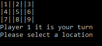
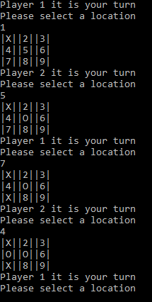
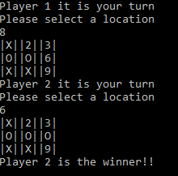

# Console Tic-Tac-Toe Game

Lab04-Classes-Objects

*Author: Chris Cummings*

----

## Description
The game uses several classes to recreate the tic-tac-toe game that we all know and love.
Two players take turns inputting numbers. The goal is to get three of your character in a row.

---

### Getting Started
Clone this repository to your local machine.

```
$ git clone https://github.com/cdcummings10/Lab04--TicTacToe.git
```

### To run the program from Visual Studio:
Select ```File``` -> ```Open``` -> ```Project/Solution```

Next navigate to the location you cloned the Repository.

Double click on the ```Lab04--Lab04_TicTacToe``` directory.

Then select and open ```Lab04_TicTacToe.sln```

Click on ```Start```

### To run the executable:

Navigate to folder ```Lab03--Lab04_TicTacToe``` directory.

Navigate through these folders: ```Lab04_TicTacToe``` => ```Lab04_TicTacToe``` => ```bin``` => ```Debug```

Run ```Lab04_TicTacToe.exe```

---

### Visuals

#### Application Start

#### Playing the Game

#### Game is Won



---

### Time Estimates
Estimated time to finish: 4 Hours

Actual time to finish: 4 Hours

### Change Log 

1.0: *Finished TicTacToe Game. Added all functionality to app.* - 18 Oct 2019

1.1: *Added two more tests.* - 22 Oct 2019
